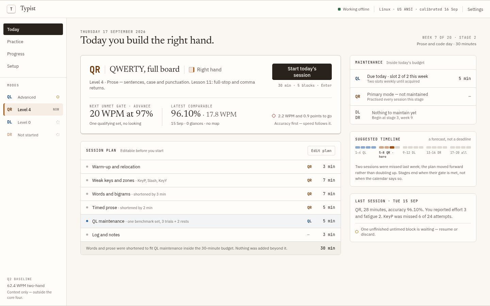

# Typist

An implementation-ready specification for a personal typing trainer that teaches QWERTY and one-hand Dvorak independently with either hand, based on the revised roadmap v1.2.

The target is **four acquired modes: 30 WPM, at least 98% accuracy, and no keyboard checking, repeated across three sessions**. Typist should guide today's practice, maintain earlier skills, expose recurring mistakes, and measure the cost of switching between hands and layouts. The suggested core program takes 20 weeks, with progress gates taking priority over dates.

**Status:** implemented as a desktop web app that works offline and stores practice data locally (IndexedDB). Milestones 1–4 (the core release) and the optional milestones 5 (Colemak, Workman, emulated Half-QWERTY) and 6 (two machines) are built; what was verified automatically, and the physical-keyboard checks that remain for you, are in [the verification report](docs/verification.md).

## Run it

Requires Node.js 22.12 or later, on Linux with Chrome/Chromium or Firefox.

```sh
npm ci
npm run dev        # development server with fixtures, http://localhost:5173
npm run build      # typecheck, production bundle in dist/, third-party licenses
npm run preview    # serve the production bundle (service worker, offline)
npm run verify     # content check, typecheck, unit tests, build
npm run test:e2e   # browser tests (Chrome and Firefox; builds first)
```

Before practising, add the OS input sources you train with (GNOME: Settings → Keyboard → Input Sources): *English (US, intl., with dead keys)* for QWERTY, and *English (Dvorak, left-handed)* / *English (Dvorak, right-handed)* for DL/DR. Onboarding confirms your keyboard geometry (ANSI or ABNT2), and calibration checks every key against the layout table before any benchmark counts.

The optional two-machine module needs a small coordinator on your network; see [two-machine setup](docs/dual-machine-setup.md).

## Read the specification

| Document | Purpose |
| --- | --- |
| [Product specification](SPEC.md) | Outcomes, scope, screens, and product requirements |
| [Training protocol](docs/training-protocol.md) | Curriculum, advancement, acquisition, scheduling, maintenance, and switching |
| [Input and layouts](docs/input-and-layouts.md) | Actual OS layouts, keyboard geometry, calibration, fingering, and input handling |
| [Measurement contract](docs/measurement.md) | Scoring formulas, benchmark eligibility, comparison rules, and worked examples |
| [Architecture and data](docs/architecture.md) | Components, state transitions, persistence, and data contracts |
| [Visual design system](design/README.md) | Original design canvas, light/dark tokens, screen previews, and implementation review |
| [Two-machine endgame](docs/dual-machine.md) | Optional coordinated practice on two machines, baselines, and dual efficiency |
| [Build plan and acceptance](docs/build-plan.md) | Ordered implementation milestones and observable acceptance scenarios |
| [Verification report](docs/verification.md) | Environment, commands, automated results, acceptance coverage, and the manual keyboard checklist |
| [Two-machine setup](docs/dual-machine-setup.md) | Certificates, coordinator, and connectivity checks for the optional two-machine module |
| [Training defaults](config/training-defaults.json) | Machine-readable mode catalog and protocol parameters |
| [Sources and decisions](docs/sources-and-decisions.md) | Roadmap traceability, verified references, assumptions, and design decisions |
| [Revised roadmap](references/Ambidextrous_One-Hand_Touch_Typing_Roadmap_v1_2.pdf) | User-supplied source of truth, version 1.2, September 2026 |

## Core modes

| Layout | Left hand | Right hand | Method |
| --- | --- | --- | --- |
| QWERTY | QL | QR | One hand covers the ordinary full board |
| Dvorak | DL | DR | Separate left-handed and right-handed Dvorak layouts |

These are four skills backed by three logical layouts. Each mode keeps its own curriculum, fingering ledger, benchmark history, and maintenance schedule. Colemak, Workman, Half-QWERTY, and the dual-machine experiment are optional expansions after core completion.

The initial target assumes a physical US ANSI keyboard on Linux; onboarding must verify that assumption. Keyboard geometry and OS layout variants are explicit profiles so other setups can be added without mixing incompatible results. English prose is the reference benchmark; Portuguese and code are separate practice tracks.


## Visual reference

The supplied design establishes the warm neutral palette, serif headings, monospaced practice surface, tactile keycaps, and separate hand identities. The [design handoff](design/README.md) includes reusable tokens and [review notes](design/REVIEW.md) for implementation.


