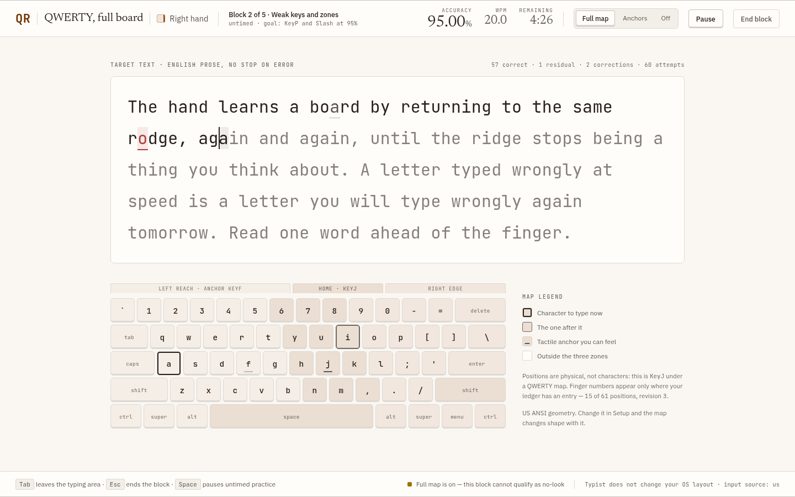
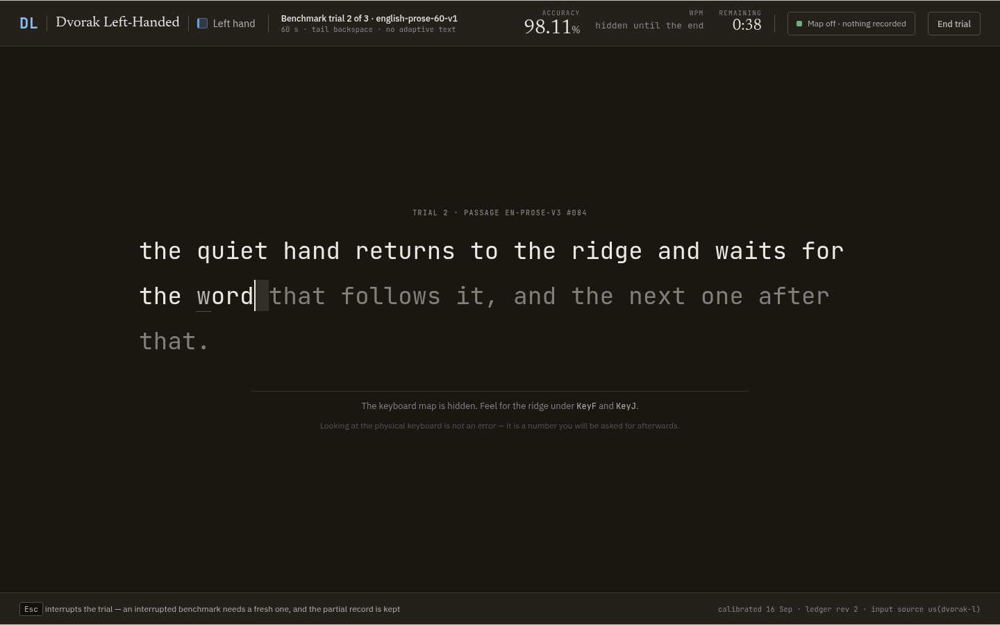

# Typist visual system

Design handoff supplied in `Design form feedback.zip`, imported on 17 September 2026. Use its visual direction and component language for the Typist implementation. The training, input, measurement, and persistence contracts remain defined by the [product specification](../SPEC.md) and its linked documents.

The direction combines warm neutral surfaces, Newsreader headings, IBM Plex Sans interface text, JetBrains Mono practice text, quiet dividers, and tactile keycap edges. Slate identifies the left hand; ochre identifies the right. Both roles retain explicit labels and edge markers. Light is the primary theme, with a complete dark palette.

## Files

| File | Use |
| --- | --- |
| [Original design canvas](reference/Typist%20Design%20System.dc.html) | Full visual direction, components, screens, and handoff; preserved unchanged |
| [Original preview runtime](reference/support.js) | Required by the exported canvas; preserved unchanged |
| [Original design notes](reference/github.md) | Designer's screen-to-spec mapping and export notes |
| [Original thumbnail](reference/thumbnail.webp) | Export's `.thumbnail`, renamed without changing its bytes |
| [CSS tokens](tokens.css) | Canonical extracted variables for application styling, with zone scope corrected |
| [JSON tokens](tokens.json) | Convenience token data with both theme palettes complete; custom format, not a published token schema |
| [Review and implementation notes](REVIEW.md) | Verified gaps, corrections, and behavior requirements for implementation |
| [Import manifest](manifest.json) | Archive checksum, original file checksums, and derived-file provenance |

The canvas contains demonstrations and sample state. Its typing counter, timer, and simulated save action are not the application's measurement or persistence implementation. The original designer notes are retained as provenance, including claims that the review qualifies.

## Preview locally

From the repository root:

```sh
python3 -m http.server 8765 --bind 127.0.0.1 --directory design/reference
```

Open [the design canvas](http://127.0.0.1:8765/Typist%20Design%20System.dc.html). The reference loads its original React/ReactDOM/Babel preview dependencies from unpkg and its fonts from Google Fonts, so the interactive reference needs network access. The future offline application must bundle its dependencies and font files with their license notices.

The export is a fixed-width presentation canvas. Its written responsive rules are guidance for the application, not implemented responsive behavior in this file.

## Screen previews

These are browser captures of the original 1440×900 mockups. Their text, values, and interaction hints remain those of the supplied design; consult [the review](REVIEW.md) for corrections before implementing them.

### Today


### Practice



### Focused practice



## Applying the tokens

Load `tokens.css`, select a theme with `data-theme="dark"` when appropriate, and apply `data-hand="left"` or `data-hand="right"` to each mode-owned subtree. Shared navigation should not inherit a hand identity accidentally. Zone tints are defined in the hand scope so they resolve against that subtree's hand color.

The CSS handoff is authoritative when the original visual swatch label disagrees with it. The normalized JSON uses the CSS dark palette to fill the original JSON omissions and supplies the referenced font families and remaining type roles. It intentionally uses `formatVersion: 1` instead of the export's non-resolvable `$schema` label.

Keep tokens separate from lesson/benchmark logic. Build semantic, accessible application components from the visual reference, with the [review's implementation checks](REVIEW.md#implementation-checks) included in the normal release verification.
