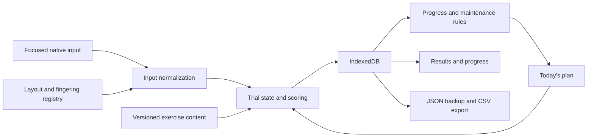
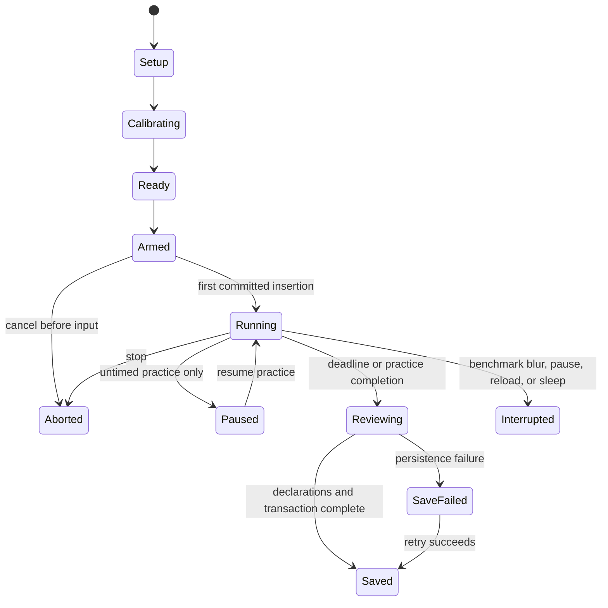

# Architecture and data

## Technical direction

Use TypeScript for the application and domain logic, React for the interface, and Vite for the static build. Keep metrics, gate evaluation, exercise generation, and planning as pure modules independent of React. Choose and pin supported dependency versions when implementation begins; this specification does not pretend a lockfile already exists.

Use IndexedDB for structured local records, a service worker for the app shell and bundled corpora, and JSON/CSV file export for portability. The core product needs no backend. The optional [two-machine module](dual-machine.md) adds a small Node.js coordination service and uses the same domain scoring code.

Do not send every key through expensive global UI state. Keep the event reducer immediate, batch display updates, and move heavy history aggregation off the keystroke path. Durations and scores derive from recorded events, not rendered characters or frame counts.

## State transitions

Ordinary block lifecycle:

`Reviewing` may persist pending declarations without claiming a gate. Invalid/interrupted trials are also saved with their status and partial counters. A new trial always gets a new ID; replacing an interrupted test never edits it into a valid one. A session contains multiple blocks and trials, and is distinct from a benchmark set.

Switch probes use `cue → preparing → typing-streak → complete/timeout/interrupted`. Preparation permits OS-menu focus loss while visible, without pausing its clock. Typing-streak blur invalidates it. Dual trials use the coordinated fixed start specified in their module, not ordinary first-input timing.

## Data contracts

IDs are UUIDs; built-in catalog IDs and protocol IDs are stable strings. Every persisted record has a schema version. Store wall-clock timestamps in UTC for display/history, IANA timezone and local date for scheduling, and monotonic trial-relative milliseconds for measurements. Never compare raw monotonic clocks from different machines.

| Record | Required information |
| --- | --- |
| Profile | ID, preferred name (optional), dominant hand, timezone, practice days, daily budget, primary mode, start date, UI preferences |
| KeyboardSetup | ID/revision, geometry/version, keyboard label, OS/session/browser, layout variant per mode, modifier/remap settings, per-hand keyboard offset, chair/desk notes |
| LayoutDefinition | ID/revision, source/revision, supported geometry, base/Shift/dead-key mappings, special actions, calibration fixtures and verification status |
| Calibration | ID, setup/layout revisions, checked positions, expected/observed output, capability results, date, status |
| FingeringLedger | ID/revision, mode/setup IDs, preferred position-zone-finger mappings, anchor definitions, notes, effective date, freeze suggestion |
| Exercise | ID/version, kind, language, introduced character set, text or generator recipe, seed, normalized text hash, corpus license/provenance |
| Session | ID, start/end UTC, timezone/local date, planned/actual blocks and minutes, fatigue before/after, effort, note, completion status |
| Trial | ID/session/block, mode, protocol/scorer versions, immutable setup/layout/ledger/exercise snapshots or content-addressed references, duration, status, counters, declarations, invalidity reasons |
| TrialEvent | Trial ID, sequence, relative milliseconds, kind, expected/produced grapheme, target index, code/modifiers when known, assistance/focus/correction observations |
| BenchmarkSet | ID/session/date, exactly three contributing trial IDs when complete, all attempted/replacement IDs, per-metric medians, eligibility, qualification by gate, comparison signature |
| Milestone | Mode/target/protocol, awarded date, contributing set IDs, evaluated thresholds, historical status; never an unexplained boolean |
| MaintenanceState | Mode/series, baseline set IDs and value, latest comparison IDs, loss, due dates/frequency, reason and last recomputed time |
| SwitchProbe | From/to modes and revisions, cue time, sequence/seed, streak events, elapsed milliseconds or timeout bound, outcome, declarations |
| CoreCompletion | Awarded date, four mode milestone IDs and current stability set IDs |
| DualRun | Shared run/manifest IDs, two device roles, mode pair, tasks, clock estimates, solo baseline IDs, side trial IDs, synchronization validity, combined metrics |

Config edits create new revisions. Store enough immutable snapshots with a trial that editing/deleting a current setup cannot make history uninterpretable. Derived aggregates can be rebuilt from canonical trial records. Historical milestones keep the evidence and rules that justified them; a new scorer/protocol creates a new evaluation view rather than silently changing the old label.

Record data origin (`native-run`, `restored-typist`, `manual-external`) and measurement verification status. Self-report remains self-report after export/import. Unknown values remain null; a migration must not manufacture zero glances or claim an observed hand.

## Content contract

Bundle original or appropriately licensed content, with attribution in a corpus manifest. The implementation should supply at least 200 beginner English words, coverage sequences for every supported key, and 12 original prose passages of at least 2,000 printable characters each. Provide additional original text for numbers, symbols, and code. Do not scrape another tutor's proprietary lesson sequence.

Every generated exercise stores its seed, generator version, normalized prompt/hash, and eligible character set. Corpus validation checks normalization, allowed characters, adequate prompt length, and reachability under its layout profile. Persist the chosen prompt before a scored trial starts so a crash or update cannot replace it.

Adaptive exercises cannot double as benchmarks. A fixed monthly passage has its own ID and version; repeating it is an explicit protocol feature, while routine benchmarks rotate passages within a frozen corpus.

## Persistence and recovery

Append event batches to an in-progress journal at least once per second and on block boundaries. Write final trial counters, declarations, and derived set/milestone updates transactionally. Display “Saved” only after commit. On startup, recover incomplete journals as interrupted records; never resume a scored clock across browser restarts. At most one active writer tab per profile is permitted, enforced by a transactional IndexedDB lease with expiry; another tab offers read-only progress or an explicit takeover that interrupts the old run.

Keep all benchmark, milestone, and switch evidence. Raw practice events may be pruned after 90 days, retaining block summaries and explicitly marking that detailed replay is unavailable. Allow export before pruning. Never prune evidence supporting acquisition or dual comparisons as a side effect of ordinary practice cleanup.

Request persistent storage when supported and show whether it was granted, but retain backup/export as the durable escape path. Browsers may decline a persistence request. [MDN StorageManager.persist](https://developer.mozilla.org/en-US/docs/Web/API/StorageManager/persist).

Handle storage-full, permission, or migration failures without erasing the old database. Keep the current result in memory, offer a downloadable recovery file, and disable further scored trials until saving is restored. Before a destructive restore, show its record counts, date span, and a backup action. User confirmation inside the app applies to replacing existing local history.

## Offline operation and updates

Precache the shell, registry, and standard corpora; load custom saved exercises from IndexedDB. Pin the running session's app/protocol/content versions. Install an update in the background and activate it between sessions, never during a timed block.

Service workers require a secure context, with localhost supported for development. A production or LAN deployment must account for that requirement. [MDN service worker guide](https://developer.mozilla.org/en-US/docs/Web/API/Service_Worker_API/Using_Service_Workers).

A failed initial download shows which assets are missing and does not claim offline readiness. Once cached, the complete core daily loop works without a connection. The optional dual module needs connectivity between its two clients and coordinator, but losing that service cannot prevent solo practice.

## Import and export

- A full backup is a JSON envelope with format/schema version, export time, profile/setup/ledger records, content manifests, trials/events, benchmark sets, milestones, and checksum. The checksum detects accidental corruption; it is not proof of genuine performance.
- Validate versions, bounds, IDs, references, character data, and checksum before any write. Preview the result. Import identical IDs/content idempotently; reject conflicting IDs/content atomically with a specific report. Unknown newer versions are rejected without altering local data.
- Support merge of nonconflicting records and an explicitly chosen full restore. A failed import leaves the current database unchanged. After a successful restore, recompute derived views and retain original historical protocol labels.
- Export trial/session CSV with mode, date, protocol, configuration signature, duration, WPM/raw WPM/accuracy, glances/assistance, fatigue/effort, validity, and notes. Escape CSV correctly and neutralize formula-leading text cells for spreadsheet use; the JSON backup retains original content.
- Reference content, custom text, and detailed key logs remain on the user's device unless the user exports them. There is no analytics SDK or routine telemetry in the core app.

## Verification boundaries

Use unit/property tests for the scorer, timing boundaries, gate aggregation, scheduler budget, seeded generation, and import validation. Use browser tests for input/composition, focus, IndexedDB failure/recovery, offline use, and accessibility. Synthetic events cannot prove OS-layout installation or physical geometry; those require the recorded manual hardware/browser matrix in the [build plan](build-plan.md).
